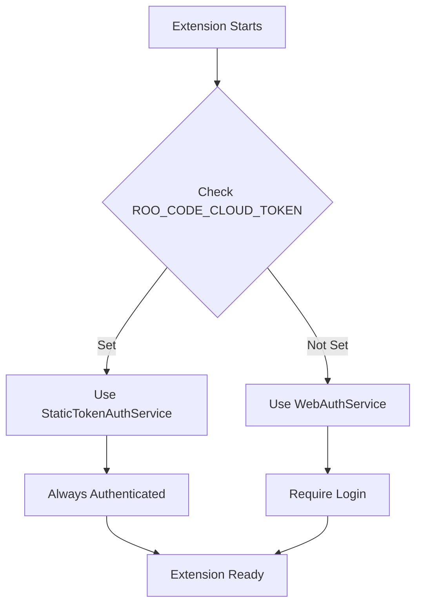

# 🚀 NoCodr Development Setup

This guide covers setting up the NoCodr extension for local development, including authentication bypass for testing.

---

## 📚 Table of Contents

1. [Quick Start](#quick-start)
2. [Authentication Bypass](#authentication-bypass)
3. [Documentation Index](#documentation-index)
4. [Development Workflow](#development-workflow)
5. [Troubleshooting](#troubleshooting)

---

## 🎯 Quick Start

### Prerequisites

- **Node.js**: v20.19.5
- **pnpm**: 10.8.1
- **VS Code**: Latest version

### Standard Development (With Authentication)

```bash
# Install dependencies
pnpm install

# Build and install extension
./rebuild-and-install.sh

# Restart VS Code (Cmd+Q then reopen)
```

### Development with Auth Bypass (No Login Required)

```bash
# Option 1: Using helper script (recommended)
cp .env.development.example .env.development
# Edit .env.development and add your token
./scripts/dev-no-auth.sh

# Option 2: Manual setup
export ROO_CODE_CLOUD_TOKEN="your-jwt-token-here"
./rebuild-and-install.sh
```

---

## 🔐 Authentication Bypass

### What is it?

Authentication bypass allows you to **skip the login flow** during development by using a static JWT token. This is useful for:

- 🧪 Testing features without internet
- ⚡ Faster development iteration
- 🤖 Automated testing
- 🔧 Debugging auth-dependent features

### How it works



### Code Flow

```typescript
// In packages/cloud/src/CloudService.ts
const cloudToken = process.env.ROO_CODE_CLOUD_TOKEN

if (cloudToken && cloudToken.length > 0) {
    // Development Mode - Bypass Active ✅
    this._authService = new StaticTokenAuthService(this.context, cloudToken, this.log)
} else {
    // Production Mode - Normal Auth Flow 🔒
    this._authService = new WebAuthService(this.context, this.log)
}
```

### Key Files

| File | Purpose |
|------|---------|
| `packages/cloud/src/CloudService.ts` | Mode selection logic |
| `packages/cloud/src/StaticTokenAuthService.ts` | Development bypass |
| `packages/cloud/src/WebAuthService.ts` | Production auth |
| `packages/cloud/src/config.ts` | API configuration |

---

## 📖 Documentation Index

### Setup Guides

- **[SUMMARY_AUTH_BYPASS.md](../SUMMARY_AUTH_BYPASS.md)** - Overview and key points
- **[DEVELOPMENT_AUTH_BYPASS.md](../DEVELOPMENT_AUTH_BYPASS.md)** - Complete implementation guide
- **[AUTH_BYPASS_QUICK_REF.md](./AUTH_BYPASS_QUICK_REF.md)** - Quick reference and cheat sheet

### Configuration

- **[.env.development.example](../.env.development.example)** - Environment variable template
- **[scripts/dev-no-auth.sh](../scripts/dev-no-auth.sh)** - Automated setup script

### Build Scripts

- **[rebuild-and-install.sh](../rebuild-and-install.sh)** - Main build and install script
- **[dev-run.sh](../dev-run.sh)** - Development run script

---

## 🔧 Development Workflow

### Standard Flow (Production Mode)

```bash
# 1. Make code changes
vim src/your-file.ts

# 2. Build and install
./rebuild-and-install.sh 1.0.2

# 3. Restart VS Code
# Cmd+Q, then reopen

# 4. Test changes
# Login when prompted
```

### Bypass Flow (Development Mode)

```bash
# 1. Set up bypass (one time)
cp .env.development.example .env.development
# Add your token to .env.development

# 2. Make code changes
vim src/your-file.ts

# 3. Build with bypass
./scripts/dev-no-auth.sh

# 4. Restart VS Code
# Cmd+Q, then reopen

# 5. Test changes
# No login required! ✨
```

### Testing Workflow

```bash
# Run unit tests
pnpm test

# Run E2E tests with Playwright
cd apps/playwright-e2e
pnpm test

# Run VS Code integration tests
cd apps/vscode-e2e
pnpm test
```

---

## 🎯 Environment Variables

### Required for Bypass

```bash
# JWT token for authentication bypass
ROO_CODE_CLOUD_TOKEN="eyJhbGciOiJIUzI1NiIsInR5cCI6IkpXVCJ9..."
```

### Optional

```bash
# Organization settings (bypass cloud settings)
ROO_CODE_CLOUD_ORG_SETTINGS='{"allowAll":true,"providers":{}}'

# Custom Clerk endpoint (default: https://clerk.roocode.com)
CLERK_BASE_URL="https://your-dev-clerk.com"

# Custom API endpoint (default: https://app.roocode.com)
ROO_CODE_API_URL="https://your-dev-api.com"
```

---

## 📊 Mode Comparison

| Feature | Production Mode | Development Mode |
|---------|----------------|------------------|
| **Login Required** | ✅ Yes | ❌ No |
| **Auth Service** | WebAuthService | StaticTokenAuthService |
| **Session Refresh** | ✅ Every 50s | ❌ Not needed |
| **isAuthenticated()** | Dynamic | ✅ Always `true` |
| **User Info Source** | Clerk API | JWT payload |
| **Environment Setup** | None | Requires token |

---

## 🔍 Verification

### Check Mode

```bash
# 1. Open VS Code Developer Console
# Cmd+Shift+P → "Developer: Toggle Developer Tools"

# 2. Look for log message:
# Production: "[auth] Using WebAuthService"
# Development: "[auth] Using StaticTokenAuthService"
```

### Verify Environment

```bash
# Check if bypass is enabled
echo $ROO_CODE_CLOUD_TOKEN

# Decode token payload
node -e "console.log(JSON.parse(Buffer.from('$ROO_CODE_CLOUD_TOKEN'.split('.')[1], 'base64').toString()))"
```

---

## 🛠️ Generate Development Token

```bash
# Using the CLI tool
pnpm --filter @roo-code-cloud/roomote-cli development auth job-token \
  --job-id 1 \
  --user-id user_YOUR_USER_ID \
  --org-id org_YOUR_ORG_ID

# Token expires in 1 hour
```

---

## 🐛 Troubleshooting

### Extension Still Asks for Login

```bash
# 1. Verify token is set
echo $ROO_CODE_CLOUD_TOKEN

# 2. Check token format (should be JWT with 3 parts)
echo $ROO_CODE_CLOUD_TOKEN | tr '.' '\n' | wc -l  # Should output 3

# 3. Restart VS Code completely
# Cmd+Q (not just close window)

# 4. Check developer console
# Look for: [auth] Using StaticTokenAuthService

# 5. Rebuild if needed
./rebuild-and-install.sh
```

### Token Expired

```bash
# Generate new token
pnpm --filter @roo-code-cloud/roomote-cli development auth job-token \
  --job-id 1 \
  --user-id user_YOUR_USER_ID \
  --org-id org_YOUR_ORG_ID

# Update and rebuild
export ROO_CODE_CLOUD_TOKEN="new-token"
./rebuild-and-install.sh
```

### Build Errors

```bash
# Clean build cache
pnpm clean

# Remove node modules
rm -rf node_modules
pnpm install

# Rebuild
./rebuild-and-install.sh
```

---

## 📁 Project Structure

```
NoCodr/
├── src/                          # Main extension source
│   ├── core/                     # Core functionality
│   ├── api/                      # API providers
│   └── services/                 # Services
├── packages/
│   ├── cloud/                    # Cloud services
│   │   └── src/
│   │       ├── CloudService.ts           # ⭐ Mode selection
│   │       ├── StaticTokenAuthService.ts # ⭐ Dev bypass
│   │       ├── WebAuthService.ts         # ⭐ Production auth
│   │       └── config.ts                 # ⭐ Configuration
│   ├── types/                    # TypeScript types
│   └── ...
├── scripts/
│   └── dev-no-auth.sh           # ⭐ Setup script
├── docs/
│   ├── DEVELOPMENT_SETUP.md     # ⭐ This file
│   └── AUTH_BYPASS_QUICK_REF.md # ⭐ Quick reference
├── .env.development.example     # ⭐ Environment template
├── DEVELOPMENT_AUTH_BYPASS.md   # ⭐ Complete guide
├── SUMMARY_AUTH_BYPASS.md       # ⭐ Summary
└── rebuild-and-install.sh       # Build script
```

---

## ⚠️ Security Notes

### Development

- ✅ **DO** use bypass for local development
- ✅ **DO** rotate tokens regularly
- ✅ **DO** keep tokens in `.env.development` (ignored by Git)
- ❌ **DON'T** commit tokens to version control
- ❌ **DON'T** share tokens between developers

### Production

- ❌ **NEVER** use bypass mode in production builds
- ❌ **NEVER** commit `.env.development` files
- ✅ **ALWAYS** verify `ROO_CODE_CLOUD_TOKEN` is NOT set in production
- ✅ **ALWAYS** use WebAuthService in production

---

## 🔗 Related Documentation

- [Main README](../README.md)
- [CHANGELOG](../CHANGELOG.md)
- [DEVELOPMENT](../DEVELOPMENT.md)
- [Architecture Documentation](./architecture/)

---

## 📞 Support

### Questions?

1. Check the documentation index above
2. Review troubleshooting section
3. Check developer console for errors
4. Review existing issues on GitHub

### Contributing

See [CONTRIBUTING.md](../CONTRIBUTING.md) for guidelines.

---

**Version**: 1.0.1  
**Last Updated**: 2025-01-09  
**Maintained by**: NoCodr Development Team
